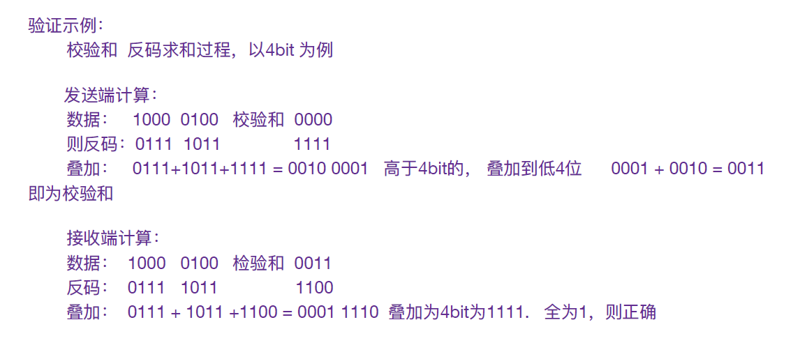

# Computer Network

### UDP\(User Data Protocol\) 用户数据报协议

UDP是⼀个⾮连接的协议，传输数据之前源端和终端不建⽴连接，当它想传送时就简单地去抓取 来⾃应⽤程序的数据，并尽可能快地把它扔到⽹络上。在发送端，UDP传送数据的速度仅仅是受 **应⽤程序⽣成数据的速度**、**计算机的能⼒和传输带宽的限制**；在接收端，UDP把每个消息段放在 队列中，应⽤程序每次从队列中读⼀个消息段。 • 由于传输数据不建⽴连接，因此也就不需要维护连接状态，包括收发状态等，因此⼀台服务机可同时向多个客户机传输相同的消息。 

UDP信息包的标题很短，只有8个字节，相对于TCP的20个字节信息包的额外开销很⼩。

吞吐量不受拥挤控制算法的调节，只受应⽤软件⽣成数据的速率、传输带宽、源端和终端主机性 能的限制。 

UDP使⽤尽最⼤努⼒交付，即不保证可靠交付，因此主机不需要维持复杂的链接状态表（这⾥⾯ 有许多参数）。

UDP是⾯向**报⽂**的。发送⽅的UDP对应⽤程序交下来的报⽂，在添加⾸部后就向下交付给IP层。 既不拆分，也不合并，⽽是保留这些报⽂的边界，因此，应⽤程序需要选择合适的报⽂⼤⼩。

### TCP与UDP的区别

TCP是⾯向连接的，UDP是⽆连接的即发送数据前不需要先建⽴链接。 

TCP提供可靠的服务。也就是说，通过TCP连接传送的数据，⽆差错，不丢失，不重复，且按序 到达；UDP尽最⼤努⼒交付，即不保证可靠交付。 并且因为TCP可靠，⾯向连接，不会丢失数据 因此适合⼤数据量的交换。 

TCP有拥塞控制和流量控制，UDP没有。

TCP是⾯向字节流，UDP⾯向报⽂，并且⽹络出现拥塞不会使得发送速率降低（因此会出现丢包，对实时的应⽤⽐如IP电话和视频会议等）。 TCP只能是1对1的，UDP⽀持1对1和1对多。

TCP的⾸部较⼤为20字节，⽽UDP只有8字节。

#### TCP和UDP校验和\(checksum\)的计算

数据校验⽬的：为了检测出因为⽹络卡顿、软硬件Bug、电缆不可靠、信号⼲扰等因素⽽造成信号 失真造成的数据错误。

**TCP校验和**

TCP⾸部校验和计算三部分：TCP⾸部+TCP数据+TCP伪⾸部。 （伪⾸部：共12字节，包含IP⾸部的⼀些字段。伪⾸部的⽬的是增加校验和的检错能⼒，⽐如通过 伪⾸部的⽬的IP地址来检查TCP报⽂是否收错了、通过伪⾸部的传输层协议号来检查传输层协议是 否选对了。）

**发送端**： ⾸先，把伪⾸部、TCP报头、TCP数据分为16位的字，如果总⻓度为奇数个字节，则在最后增添 ⼀个位都为0的字节。 • 把TCP报头中的校验和字段置为0。  其次，⽤反码相加法（对每16bit进⾏⼆进制反码求和）累加所有的16位字（进位也要累加，进位 则将⾼位叠加到低位）。  最后，将上述结果作为TCP的校验和，存在检验和字段中。

**接收端**：同样利⽤反码求和，⾼位叠加到低位， 如计算结果的16位中每⼀位都为1，则正确，否则说明发⽣错误。

#### UDP检验和

基本过程和TCP校验和相同，不同的是伪⾸部中8位传输层协议号，UDP是17⽽TCP是6。

TCP与UDP的校验和计算异同： 

TCP和UDP检验和是⼀个端到端的检验和，由发送端计算，然后由接收端验证。 

TCP和UDP检验和覆盖⾸部和数据，⽽IP⾸部中的检验和只覆盖IP的⾸部，不覆盖IP数据报中的任何数据。 TCP的检验和是必需的，⽽UDP的检验和是可选的。 

TCP和UDP计算检验和时，都要加上⼀个12字节的伪⾸部。

### TCP\(Transmission Control Protocol\) 传输控制协议

**TCP三次握⼿过程（建⽴连接）**

* ⽬的：使数据包的发送和接收同步**，**握手其实是获取通信双方数据原点的序列号
* 过程：
  1. 主机A向主机B发送一个含有同步序列号标志位（SYN）的数据段给主机B，请求建立连接。（告诉主机B：通信请求和主机B可以用哪个序列号作为起始数据段来回应）
  2. 主机B用一个带有应答（ACK）和同步序列号（SYN）标志位的数据段相应主机A，告诉主机A：可以传输数据了和主机A要用哪个序列号作为起始数据段来回应
  3. 主机A：收到数据段后再发送一个确认应答（ACK），表示要开始传输数据了
* 特点：
  * 没用应用层数据
  * SYN这个标志位只有在TCP建立的时候才会被置为1
  * 握手完成后SYN被置为0

**TCP四次挥⼿过程（断开连接）**

* 过程：
  * 当主机A完成数据传输后，将控制位FIN置为1，提出停止TCP连接的请求
  * 主机B收到FIN后对其做出相应，确认这一方向上的TCP即将关闭，将ACK置为1
  * 由B端再提出反方向的关闭请求，将FIN置为1
  * 主机A对主机B的请求惊醒确认，将ACK置为1，双方向的关闭结束

**TCP的拥塞控制机制**

**可靠重传** 对于收到的请求给出确认响应 

**超时重传** 

**流量控制** 让发送⽅的发送数据的速率不要太快，让接受⽅来得及接收 通过滑动窗⼝协议来实现流量控制 • TCP的窗⼝单位是字节，不是报⽂段，发送⽅的窗⼝⼤⼩不能⼤于接收⽅的窗⼝⼤⼩

**拥塞控制** 所谓拥塞控制就是防⽌过多的数据注⼊到⽹络中，这样可以使⽹络中的路由器或链路不致过载，避免出现拥塞和数据 ⼤量丢失。

4种⽅式： 

慢开始：慢开始的“慢”并不是指增⻓速率的慢，⽽是指在TCP开始发送报⽂段时先设置拥塞窗⼝为1。

拥塞避免：使拥塞窗⼝按线性规律增⻓。

快重传：发送⽅只要⼀连收到三个重复确认就应当⽴即重传对⽅尚未收到的报⽂段，⽽不必继续等待为其设置的重传计时器到期。 

快恢复\(与快重传配合使⽤）：当发送⽅连续收到三个重复确认时，就执⾏“乘法减⼩”算法，把慢开始⻔限减半。这 是为了预防⽹络发⽣拥塞。请注意，接下来不执⾏慢开始算法。

由于发送⽅现在认为⽹络很可能没有发⽣拥塞\(如果⽹路发⽣了严重的拥塞，就不会⼀连有好⼏个报⽂段连续达到接收 ⽅，就不会导致接收⽅连续发送重复确认\)，因此与慢开始不同之处是现在不执⾏慢开始算法（即拥塞窗⼝现在不设置 为1），⽽是把它设置为慢开始⻔限减半后的数值，然后开始执⾏拥塞避免算法（“加法增⼤”），使拥塞窗⼝缓慢地线 性增。

### TCP/IP

TCP/IP中各层的作⽤： 

应⽤层——TCP/IP协议族在这⼀层⾯有着很多协议来⽀持不同的应⽤，许多⼤家所熟悉的基于Internet的应⽤的实 现就离不开这些协议。如我们进⾏万维⽹（WWW）访问⽤到了HTTP协议、⽂件传输⽤FTP协议、电⼦邮件发送⽤ SMTP、域名的解析⽤DNS协议、远程登录⽤Telnet协议等等，都是属于TCP/IP应⽤层的；就⽤户⽽⾔，看到的是 由⼀个个软件所构筑的⼤多为图形化的操作界⾯，⽽实际后台运⾏的便是上述协议。（FTP、SMTP、TELNET、 DNS、TFTP） 

运输层——这⼀层的的功能主要是提供应⽤程序间的通信，TCP/IP协议族在这⼀层的协议有TCP和UDP。 

⽹络层——是TCP/IP协议族中⾮常关键的⼀层，主要定义了IP地址格式，从⽽能够使得不同应⽤类型的数据在 Internet上通畅地传输，IP协议就是⼀个⽹络层协议。（IP数据包） • ⽹络接⼝层——这是TCP/IP软件的最低层，负责接收IP数据包并通过⽹络发送之，或者从⽹络上接收物理帧，抽出 IP数据报，交给IP层。\(帧，⽹络接⼝协议\)

⽹络接⼝层——这是TCP/IP软件的最低层，负责接收IP数据包并通过⽹络发送之，或者从⽹络上接收物理帧，抽出 IP数据报，交给IP层。\(帧，⽹络接⼝协议\)

